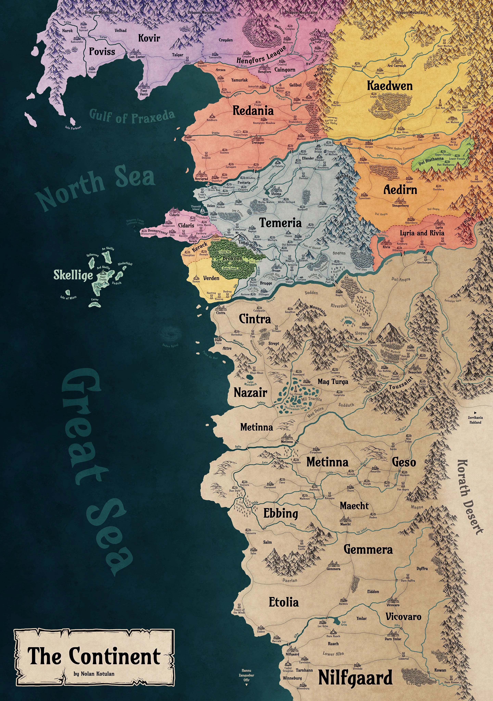

# The Continent — Rede de Fibra Óptica

Projeto de otimização de rede utilizando **Árvore Geradora Mínima (MST)** sobre o mapa de The Continent, universo de The Witcher.

O objetivo é encontrar o conjunto de rotas de menor custo que conecta todos os reinos com fibra óptica, comparando os algoritmos de **Kruskal** e **Prim**.

---

## Demonstração



> As rotas douradas formam a MST — a rede ótima de fibra óptica entre os reinos.

---

## Problema

Dado um conjunto de reinos interligados por rotas com custos variados (influenciados pelo tipo de terreno), encontrar a rede de menor custo total que mantém todos os reinos conectados.

**Modelagem como grafo:**

| Elemento | Representa |
|---|---|
| Nó | Um reino (25 no total) |
| Aresta | Rota possível de cabo entre dois reinos (45 no total) |
| Peso | Custo de instalação = `distância_km × multiplicador_terreno` |

| Terreno | Multiplicador |
|---|---|
| Planície | 1.0× |
| Floresta | 1.4× |
| Montanha | 2.5× |
| Mar | 3.5× |

O grafo é **não-dirigido** (fibra óptica funciona nos dois sentidos) e **ponderado**.

---

## Resultado

| Métrica | Valor |
|---|---|
| Reinos conectados | 25 |
| Rotas disponíveis | 45 |
| Rotas na MST | 23 |
| Custo da rede completa | 15.836 k coroas |
| **Custo da MST** | **5.701 k coroas** |
| **Economia** | **64%** |

---

## Algoritmos Implementados

### Kruskal — `src/algorithms/kruskal.py`

Ordena todas as arestas por peso e adiciona a mais barata que não forma ciclo. Usa **Union-Find** com _path compression_ e _union by rank_ para detecção de ciclos em O(α(n)).

```
Complexidade: O(E log E)
```

### Prim — `src/algorithms/prim.py`

Cresce a árvore a partir de um nó inicial, sempre adicionando a aresta mais barata que expande a fronteira da árvore. Implementado com **min-heap** (`heapq`).

```
Complexidade: O((V + E) log V)
```

> Ambos os algoritmos são implementados do zero — sem uso de funções MST de bibliotecas externas.

---

## Estrutura do Projeto

```
.
├── app.py                          # App Streamlit principal
├── calibrate.py                    # Calibrador de posições no mapa
├── requirements.txt
├── pytest.ini
├── src/
│   ├── algorithms/
│   │   ├── kruskal.py              # Kruskal + Union-Find
│   │   ├── prim.py                 # Prim com min-heap
│   │   └── mst_solver.py          # Orquestrador dos algoritmos
│   ├── models/
│   │   ├── neighborhood.py         # Dataclasses Neighborhood e Coords
│   │   └── graph.py                # FiberGraph (wrapper NetworkX)
│   ├── utils/
│   │   └── data_loader.py          # Leitura e validação do dataset JSON
│   ├── visualization/
│   │   ├── metrics.py              # Tabelas de métricas para o app
│   │   └── pyvis_graph.py          # Visualização alternativa em HTML
│   ├── assets/
│   │   └── the_continent_map.jpg   # Mapa de fundo (2880×4096 px)
│   └── data/
│       ├── the_continent_kingdoms.json   # Dataset: 25 reinos, 45 conexões
│       └── kingdom_pixel_coords.json     # Coordenadas de pixel calibradas
└── tests/
    ├── test_graph.py               # Testes do FiberGraph
    ├── test_algorithms.py          # Testes de Kruskal, Prim e MSTSolver
    └── test_integration.py         # Testes de ponta a ponta com dataset real
```

---

## Instalação e Execução

**Pré-requisitos:** Python 3.11+

```bash
# Clone o repositório
git clone https://github.com/seu-usuario/network-optimization-the-continent.git
cd network-optimization-the-continent

# Crie e ative o ambiente virtual
python -m venv venv
source venv/bin/activate        # Linux/Mac
venv\Scripts\activate           # Windows

# Instale as dependências
pip install -r requirements.txt
```

**Rodar o app principal:**

```bash
streamlit run app.py
```

**Rodar o calibrador de posições:**

```bash
streamlit run calibrate.py
```

**Rodar os testes:**

```bash
pytest
```

---

## Bibliotecas Utilizadas

| Biblioteca | Uso |
|---|---|
| [NetworkX](https://networkx.org/) | Estrutura interna do grafo (`FiberGraph`) |
| [Streamlit](https://streamlit.io/) | Interface web do app |
| [Plotly](https://plotly.com/python/) | Mapa interativo com hover e legenda |
| [Pandas](https://pandas.pydata.org/) | Tabelas de métricas |
| [pytest](https://pytest.org/) | Testes automatizados (142 testes) |

---

## Testes

```bash
pytest -v
```

```
tests/test_graph.py          # FiberGraph — nós, arestas, propriedades estruturais
tests/test_algorithms.py     # Kruskal, Prim, MSTSolver — corretude e edge cases
tests/test_integration.py    # Pipeline completo com dataset real

142 passed
```

---

## Autores

Projeto desenvolvido para a disciplina de Estruturas de Dados e Algoritmos — 2025.
